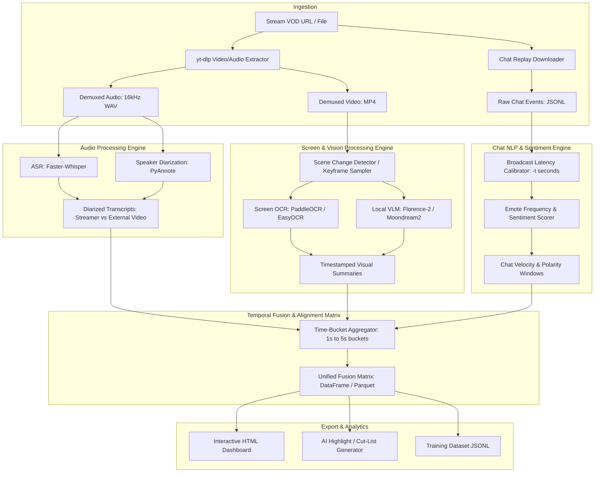

# StreamFusion: System Architecture Specification

## 1. High-Level Pipeline

---

## 2. Memory-Constrained Hardware Strategy (RTX 3060 12GB)

To operate seamlessly on consumer GPUs without out-of-memory (OOM) errors, StreamFusion adopts a **Phased Sequential Pipeline**:

### Phase A: Audio Ingestion & Extraction (GPU: 2.5 – 3.5 GB)
1. Load `faster-whisper` (medium or large-v3-turbo) in `float16` or `int8`.
2. Extract word-level timestamps.
3. Run speaker diarization (`pyannote.audio` pipeline).
4. Save diarized intervals to local cache (`cache/audio_segments.parquet`).
5. **Explicitly teardown & garbage collect:** `del model; torch.cuda.empty_cache()`.

### Phase B: Vision & Screen Processing (GPU: 2.0 – 4.0 GB)
1. Sample frames using `ffmpeg` scene detection (threshold: 0.3) or static stride (every 2.0 seconds).
2. Load lightweight VLM (Microsoft Florence-2-base / large or Moondream2).
3. Batch-infer keyframes for scene description and screen text extraction.
4. Save frame descriptions to local cache (`cache/visual_keyframes.parquet`).
5. **Explicitly teardown & garbage collect:** `del model; torch.cuda.empty_cache()`.

### Phase C: Chat Parsing & Latency Alignment (CPU-bound)
1. Vectorize chat replay messages using Polars/Pandas.
2. Group into discrete temporal buckets (default: 2.0s windows).
3. Compute message velocity (msgs/sec), emote proportions (OMEGALUL, Pog, L, W, ???), and sentiment score.
4. Apply latency compensation offset: $T_{event} = T_{chat} - \Delta_{latency}$ (where $\Delta_{latency} \approx 4.0s$).

### Phase D: Matrix Fusion & Export (CPU-bound)
1. Perform outer join on time-bucket keys.
2. Interpolate visual state across speech and chat spikes.
3. Emit final Parquet dataset and interactive HTML report.
