# StreamFusion: Architecture & Technology Stack Specification

## 1. Curated Technology Stack & Technical Rationale

Every tool in the StreamFusion stack was selected after strict architectural evaluation of performance, VRAM consumption, and reliability on consumer hardware (RTX 3060 12GB).

```
+-----------------------------------------------------------------------------------------+
|                                STREAMFUSION ARCHITECTURE                                |
+-----------------------------------------------------------------------------------------+
| CLI & Config:      Typer + Rich + Pydantic v2                                           |
| Ingestion:         yt-dlp + TwitchDownloader / chat-downloader + ffmpeg                 |
| Audio Pipeline:    faster-whisper (CTranslate2) + pyannote.audio 3.1                     |
| Vision Pipeline:   PySceneDetect + Microsoft Florence-2 (base/large) + Pillow            |
| Data Analytics:    Polars / Pandas + NumPy + SciPy (cross-correlation)                  |
| Export & Storage:  Apache Parquet + Jinja2 HTML Dashboard + MinIO/S3 Client             |
+-----------------------------------------------------------------------------------------+
```

---

### Layer-by-Layer Evaluation

| Layer | Component | Choice | Why Chosen vs. Alternatives |
|---|---|---|---|
| **CLI & Interface** | CLI Framework | **Typer + Rich** | Type-safe, auto-completing, beautiful formatted progress bars; significantly cleaner than argparse or raw Click. |
| **Data Contracts** | Schema Validation | **Pydantic v2** | Rust-backed performance (10-20x faster than v1), strict JSON serialization, automatic schema generation. |
| **Media Extraction** | VOD Downloader | **yt-dlp** | Actively maintained, bypasses throttling, supports direct time-range slicing (`--download-sections`) without downloading full 15GB files. |
| **Chat Replay** | Chat Downloader | **chat-downloader / TwitchDownloaderCLI** | Extracts millisecond-accurate chat offset, badges, and Twitch/BTTV/7TV emotes into clean JSON. |
| **Audio Demuxing** | Audio Extraction | **ffmpeg** | Industry standard, zero loss, extracts 16kHz mono WAV directly from video container. |
| **Speech-to-Text** | ASR Engine | **faster-whisper** (CTranslate2) | **4x faster than OpenAI Whisper**, uses 50% less VRAM (~2.5 GB for large-v3-turbo vs 6GB on standard PyTorch Whisper), INT8/FP16 quantization. |
| **Speaker Separation**| Diarization | **pyannote.audio 3.1** | State-of-the-art neural diarization; detects distinct voice embeddings to separate streamer microphone from YouTube video audio. |
| **Frame Sampling** | Scene Detection | **PySceneDetect** | Instead of scanning 216,000 frames in an hour, detects content cuts and pauses, reducing vision workload by **95%**. |
| **Vision & Screen** | Vision-Language Model | **Microsoft Florence-2-base** | **Only 1.2 GB VRAM**, <150ms latency per frame; combines Dense Captioning, Object Detection, and Screen OCR into a single promptable model. Beats Qwen2-VL-7B and BLIP on speed and memory. |
| **Latency Tuning** | Dynamic Calibration | **SciPy signal.correlate** | Mathematical cross-correlation between audio/visual trigger peaks and chat message density; auto-calibrates the exact 3–8s broadcast delay. |
| **Data Storage** | Table Storage | **Apache Parquet** | Columnar, compressed (10x smaller than CSV), lightning-fast reads for AI data loaders and Pandas/Polars. |

---

## 2. Hardware Resource Budget (RTX 3060 12GB Profile)

The RTX 3060 has **12,288 MiB VRAM**. Windows WDDM reserves ~1.2 GB for the OS display and apps. Available usable VRAM is ~**10.5 GB**.

StreamFusion guarantees safety by executing in **sequential isolated phases**:

```mermaid
gantt
    title RTX 3060 VRAM Allocation Across Sequential Pipeline
    dateFormat X
    axisFormat %s s

    section Phase 1: Audio
    Load faster-whisper (FP16)       :active, p1, 0, 30
    Run Diarization (pyannote)       :active, p2, 30, 60
    Unload & torch.cuda.empty_cache():crit, p3, 60, 65

    section Phase 2: Vision
    Load Florence-2-base             :active, v1, 65, 95
    Batch Process Keyframes          :active, v2, 95, 125
    Unload & torch.cuda.empty_cache():crit, v3, 125, 130

    section Phase 3: Alignment (CPU)
    Matrix Join & Latency Offset     :done, f1, 130, 150
    Generate HTML & Parquet          :done, f2, 150, 160
```



* **Audio Phase Peak:** ~3.5 GB VRAM (Whisper 2.0GB + Diarization 1.5GB) $\rightarrow$ **Safe headroom: 7.0 GB**
* **Vision Phase Peak:** ~2.2 GB VRAM (Florence-2 1.6GB + Batch tensor 0.6GB) $\rightarrow$ **Safe headroom: 8.3 GB**
* **Alignment Phase:** 0 GB VRAM (Runs on CPU RAM via Polars/Pandas).

---

## 3. Homelab Offloading & Distributed Architecture

For users with a homelab server (even with legacy K40/K80 GPUs), StreamFusion uses a **Decoupled Client/Worker Pattern**:

1. **Storage Node (Homelab):**
   * Hosts high-capacity storage (SMB, NFS, or MinIO S3 bucket).
   * Holds the heavy 1080p raw stream files, frame archives, and SQLite/Parquet databases.
2. **Compute Worker (Windows RTX 3060):**
   * Pulls stream chunks from homelab via ZeroTier IP (`10.147.x.x`).
   * Performs high-speed Whisper and Florence-2 inference.
   * Pushes the lightweight metadata results back to the homelab.
