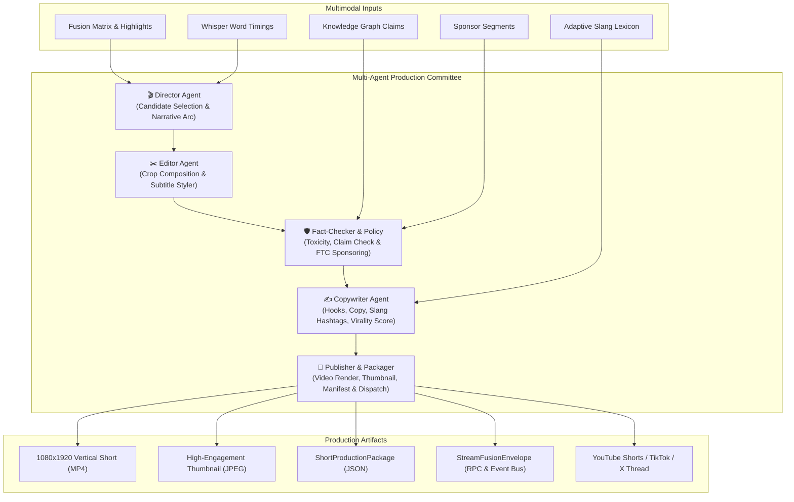

# StreamFusion Spec 21: Autonomous Multi-Agent Short Production & Auto-Publisher

## 1. Executive Summary & Problem Statement

Streamers broadcast for 4–10 hours per day, yielding dozens of high-value viral moments, intense gameplay clutches, dramatic hot takes, and community meme reactions. However, manually clipping, framing into 9:16 vertical video, styling subtitles, auditing for platform safety/sponsor disclosures, and drafting viral copy for YouTube Shorts, TikTok, and X/Twitter takes hours of tedious post-production work.

**Spec 21 introduces an autonomous multi-agent production committee** within StreamFusion that acts as a 24/7 automated studio:
1. **The Director Agent**: Evaluates highlight scores, chat burst velocity, acoustic laughs/screams, and streamer claim controversy to curate the top viral candidates and structure the narrative arc (Hook $\to$ Climax $\to$ Reaction).
2. **The Editor Agent**: Designs precise frame-accurate cuts, dynamic facecam/content bounding boxes, word-level animated karaoke subtitle styling, and audio ducking cues.
3. **The Fact-Checker & Policy Agent**: Audits every candidate against toxicity guidelines, checks streamer claims against the verified Knowledge Graph, and enforces FTC sponsor disclosure requirements (tagging `#ad` / `#sponsored` if an active sponsor segment overlaps).
4. **The Copywriter Agent**: Crafts platform-specific titles, viral hooks, adaptive slang-aware hashtag clouds, and X/Twitter multi-post threads, computing a calibrated Virality Score (0–100).
5. **The Publisher Agent**: Renders the vertical 1080x1920 MP4 via `VerticalHighlightClipper`, extracts the highest-engagement thumbnail frame, wraps everything in a standardized `StreamFusionEnvelope`, and dispatches to platform publishing adapters (or dry-run JSON staging).



---

## 2. Core Data Contracts

All models inherit from Pydantic `BaseModel` and integrate with `StreamFusionEnvelope` and `SchemaRegistry`.

### 2.1 ShortCandidate & NarrativeArc
```python
class NarrativeArc(str, Enum):
    HOOK_BUILDUP_PAYOFF = "HOOK_BUILDUP_PAYOFF"  # Classic viral hook -> rising tension -> climax
    INSTANT_CLIMAX_REACTION = "INSTANT_CLIMAX_REACTION"  # Immediate scream/laugh -> chat explosion
    HOT_TAKE_AND_DEBATE = "HOT_TAKE_AND_DEBATE"  # Controversial streamer claim -> chat polarization
    SPONSOR_SHOWCASE = "SPONSOR_SHOWCASE"  # Brand integration highlight

class ShortCandidate(BaseModel):
    candidate_id: str = Field(default_factory=lambda: str(uuid.uuid4())[:8])
    start_sec: float
    end_sec: float
    duration_sec: float
    peak_timestamp_sec: float
    highlight_score: float
    chat_burst_zscore: float
    primary_emotion: str
    narrative_arc: NarrativeArc
    hook_text: str
    summary: str
    dominant_slang: List[str] = Field(default_factory=list)
```

### 2.2 EditorialCutPlan
```python
class CropLayout(str, Enum):
    STACKED_CAM_CONTENT = "STACKED_CAM_CONTENT"  # Cam top 40% (1080x768), Content bottom 60% (1080x1152)
    FULL_CONTENT_PAN_SCAN = "FULL_CONTENT_PAN_SCAN"  # 9:16 pan and scan on primary action
    CAM_PIP = "CAM_PIP"  # Picture-in-picture overlay

class SubtitleStylePreset(str, Enum):
    KARAOKE_POP = "KARAOKE_POP"  # Bright yellow/green active word bounce with thick black outline
    CLEAN_MINIMAL = "CLEAN_MINIMAL"  # White sans-serif centered lower-third
    MEME_EMOTE = "MEME_EMOTE"  # Inject detected Twitch emote glyphs next to active keywords

class EditorialCutPlan(BaseModel):
    crop_layout: CropLayout = CropLayout.STACKED_CAM_CONTENT
    facecam_box: Optional[Dict[str, float]] = None  # {x, y, w, h}
    content_box: Optional[Dict[str, float]] = None
    subtitle_preset: SubtitleStylePreset = SubtitleStylePreset.KARAOKE_POP
    highlight_word_color: str = "&H0000FFFF"  # Yellow
    burn_subtitles: bool = True
    audio_duck_music_db: float = -12.0
    hook_duration_sec: float = 3.0
```

### 2.3 ContentAuditReport
```python
class AuditStatus(str, Enum):
    PASSED = "PASSED"
    FLAGGED = "FLAGGED"
    REJECTED = "REJECTED"

class ContentAuditReport(BaseModel):
    audit_status: AuditStatus = AuditStatus.PASSED
    toxicity_score: float = 0.0  # 0.0 to 1.0 (0 = clean, 1 = severely toxic)
    flagged_terms: List[str] = Field(default_factory=list)
    has_sponsored_content: bool = False
    sponsor_brand_names: List[str] = Field(default_factory=list)
    ftc_disclosure_required: bool = False
    disclosure_tag: Optional[str] = None  # e.g., "#ad", "#sponsored"
    claim_verified: bool = True
    claim_notes: Optional[str] = None
```

### 2.4 PlatformCopyBundle & ViralityScoreCard
```python
class PlatformCopyBundle(BaseModel):
    youtube_title: str  # <= 100 characters, catchy with emojis
    youtube_description: str
    youtube_tags: List[str]
    tiktok_caption: str  # <= 2200 characters with viral hashtags
    tiktok_hashtags: List[str]
    twitter_thread: List[str]  # 2-4 sequential posts <= 280 chars each
    hook_headline: str

class ViralityScoreCard(BaseModel):
    overall_virality_score: float  # 0 to 100
    hook_strength: float  # 0 to 100
    pacing_score: float  # 0 to 100
    chat_resonance: float  # 0 to 100
    meme_potential: float  # 0 to 100
    predicted_completion_rate: float  # Estimated percentage (e.g. 78.5%)
```

### 2.5 ShortProductionPackage
```python
class ShortProductionPackage(BaseModel):
    package_id: str = Field(default_factory=lambda: str(uuid.uuid4()))
    created_at: datetime = Field(default_factory=lambda: datetime.now(timezone.utc))
    candidate: ShortCandidate
    editorial_plan: EditorialCutPlan
    audit_report: ContentAuditReport
    copy_bundle: PlatformCopyBundle
    virality: ViralityScoreCard
    video_path: Optional[str] = None
    thumbnail_path: Optional[str] = None
    envelope_id: Optional[str] = None
```

---

## 3. The Multi-Agent Production Committee

### 3.1 Director Agent (`DirectorAgent`)
- Scans `StreamAnalysisResult` highlight points or high-density fusion slices ($> 0.6$ highlight score, chat burst velocity $> 2.0$, acoustic energy spikes).
- Identifies optimal boundary window ($15\text{s} \le \Delta t \le 60\text{s}$) centered around climax, padding 2–4s lead-in for context and 3s post-punchline buffer.
- Classifies `NarrativeArc` and assigns hook strategy.

### 3.2 Editor Agent (`EditorAgent`)
- Maps spatial layout for vertical cropping (Facecam detection / Content bounding boxes).
- Formats word timings into styled `.ass` karaoke subtitle events with dynamic word highlighting.
- Generates precise FFmpeg command parameters via `VerticalHighlightClipper`.

### 3.3 Fact-Checker & Policy Agent (`PolicyAgent`)
- Cross-references streamer statements against `StreamerClaim` records from Knowledge Graph.
- Scans chat logs and audio transcript for hate speech, severe toxicity, and DMCA strikes.
- Intersects timeline with `SponsorSegment` and applies mandatory FTC disclosure `#ad` tags.

### 3.4 Copywriter Agent (`CopywriterAgent`)
- Synthesizes hook, emotion, and dominant slang terms discovered by `AdaptiveLexiconStore` (Spec 17).
- Formats compliant titles and captions for YouTube Shorts, TikTok, and X/Twitter threads.
- Computes multi-factor virality score:
  $$\text{Virality} = 0.35 \times \text{Hook} + 0.25 \times \text{ChatResonance} + 0.20 \times \text{Pacing} + 0.20 \times \text{MemePotential}$$

### 3.5 Publisher & Packaging Agent (`PublisherAgent`)
- Calls `VerticalHighlightClipper` to render vertical short MP4.
- Extracts representative thumbnail frame at peak emotional or visual contrast timestamp.
- Exports `ShortProductionPackage` JSON and emits `StreamFusionEnvelope` with event type `SHORT_PRODUCED`.
- Dispatches to mock/live platform adapters (`YouTubePublisher`, `TikTokPublisher`, `TwitterPublisher`).

---

## 4. CLI & JSON-RPC 2.0 Integration

### CLI Subcommands:
- `streamfusion shorts generate`: Run multi-agent committee on analysis results to produce packaged vertical clips.
- `streamfusion shorts publish`: Publish produced short package to specified platform (or dry-run mock).
- `streamfusion shorts inspect`: Inspect virality scores, copy, and audit report of a short package.
- `streamfusion shorts list`: List all generated shorts in an output directory.

### Agent RPC Methods:
- `streamfusion.produceShorts`: Trigger short generation from an indexed stream session.
- `streamfusion.listShorts`: Query generated short packages with virality filters.
- `streamfusion.publishShort`: Dispatch short package to target platform.
